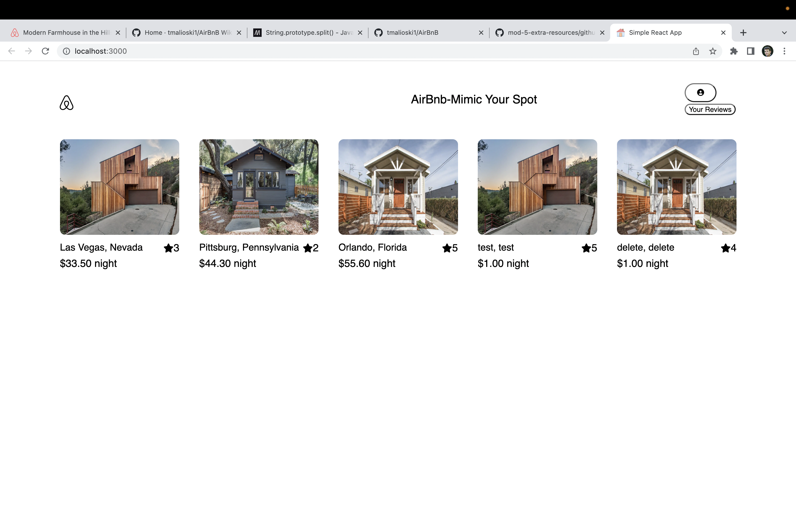

# Welcome to AirBnbMimic
A no-frills clone of the popular home rental application AirBnb designed to match the style and base functionality.

# Documentation
Render Live Deployment link:
https://airbnb-mimic.onrender.com/

# Technologies Used
.React
.Redux
.Javascript
.HTLM
.CSS
.Express
.Sequelize

# Features
 HOME PAGE DEMO USER:
 You will be able to test the app's features without having to sign up or log in by clicking the 'Demo User' button.

SPOT DETAILS:
The user can access further information, including reviews, for each spot.

FORMS:
The user can create and edit new spots and create new reviews using a simple login form.

# Getting Started
Clone this repo from the following link: https://github.com/tmalioski1/AirBnb.  Then CD into the directory where you would like to clone this project.  Clone the repo into your directory.  Once you have sucessfully cloned the repo, cd into both the back and front end and run npmStart on each.

# Road Map
The next feature to work on is bookings. I will also need to better integrate spot and review images.
I also want to refactor my error messages and some of my buttons- making buttons hidden to users that should not or do not need to use them, whereas I now primarily return errors.

# Contact Information
https://www.linkedin.com/in/tyler-malinoski/
